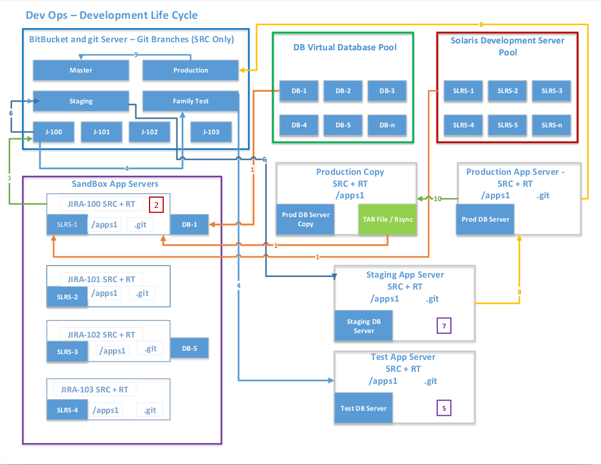
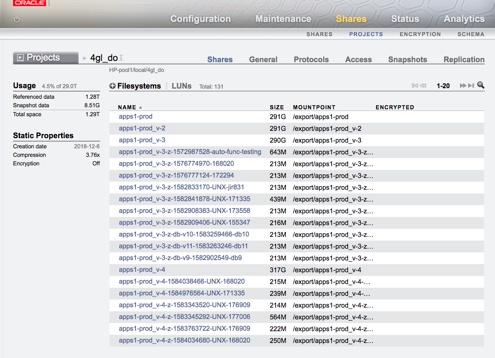

 

This repository contains a Web GUI to create/delete/manage an Oracle Solaris DevOps like environment. the application is so configured that it is fully stateless such as its not depended on the Solaris environment.

Below is a partial list on what can be done with the Web UI.
<ul>
<li>There are <b>4</b> zone types. <i>DB, FS, ,APP and OTHER</i>.</li>
<li>Create / clone zones using zone/zfs technology.</li>
<li>If the Zone type is FS or DB a new DB/FS zone will get created i.e. a new version will be auto-generated. this uses ZFS local replication for an independent copy/clone.</li>
<li>While creating/Cloning a new Jira/APP Zone type, a ZFS file system will get cloned Uniq to this Zone, you have the option to select the source version app to use.</li>
<li>You can refresh a Zone App or DB file system both at the same time, or select app/DB. this will destroy the old ZFS snap/clone and create a new one uniq to this Zone</li>
<li>A ZFS snap history trail is available to each zone</li>
<li>Each Zone can be. Power-On/Off, Reboot, Refresh source ZFS file systems(If zone type is APP)</li>
<li>You can delete any Zone not in Locked stat</li>
<li>You can view zone stat i.e. running/installed/etc.. </li>
<li>The system captures and keeps track. zone owner, zone port, and much more..</li>
</ul>

The repository consists of a frontend(Angular), backend(Node). it will also requires a Mongo DB (primarily using the MEAN stack). compatible / tested with Oracle Solaris 11.3/11.4+, the management platform was tested on Linux & Mac.

Note: The existing Python commend line interface (https://github.com/elik1001/devops-on-solaris) will continue to work and has been enhanced to work with the new WebUI. However, not all functionality has been migrated. the script uses mostly Python code not REST.

Below are instructions on how to install, configure and use the Solaris DevOps Management GUI. the GUI helps automate Oracle Solaris Zone deployments as well as snap/cloning a ZFS associated file systems which then gets mounted in the zone by NFS, created on a ZFS Appliance. See the deployment notes for additional details.

<b>Detail release notes are available <a href="VERSION.md">available here</a></b>.

<h3>Getting Started</h3>
<h4>Installation</h4>
<h4>Dependencies / Prerequisites</h4>

<b>The following are required and used:</b>
<pre>
Angular (8+)
NodeJs (12+)
MongoDB (4.x+)
ZFSSA
</pre>

<h4>Application Details</h4>
<h5>Application Directory Structure</h5>

The directory layout are explained below.
<ol>
<li><b>backend: </b>All backend code (NodeJS) are in this directory.</li>
<li><b>frontend/zoneAdmin: </b>All frontend code (Angular) are in this directory.</li>
<li><b>docs: </b>Application documentation.</li>
<li><b>images: </b>Images related to the application</li>
</ol>

<h4>For the Quick Setup guide <a href="docs/quick-setup.md">click here</a></h4>

<h4>Additional Detail</h4>
For additional configuration details please follow this document <a href="docs/README.md">configuration documentation</a>.

For Solaris Global host configuration details please follow this document - section <a href="docs/README.md">Solaris Global Configuration</a>.

Below is an sample workflow we are using.
 

Screen shout of the associated ZFS Appliance snap/clone(s).
 

<h4>License</h4>
This project is licensed under the MIT License - see the LICENSE file for details.
