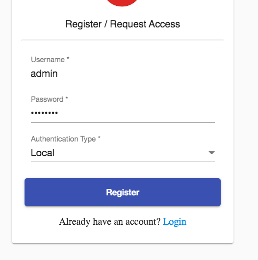
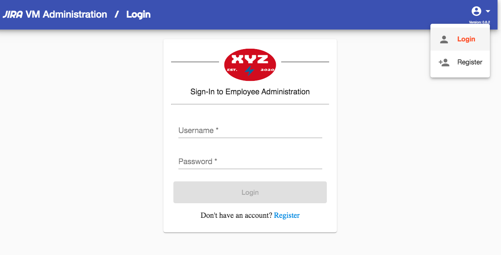
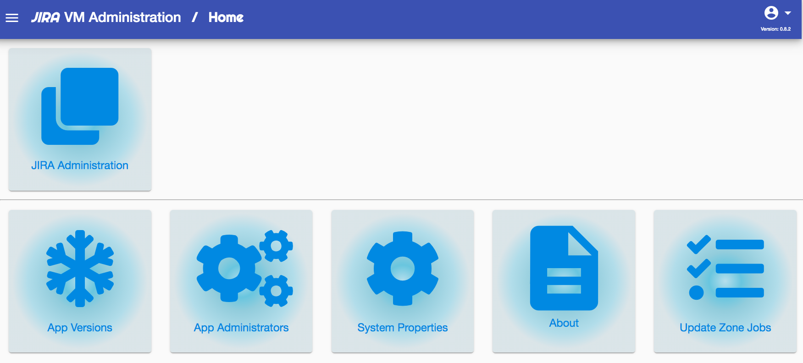
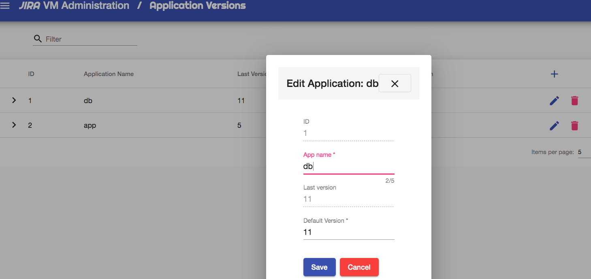
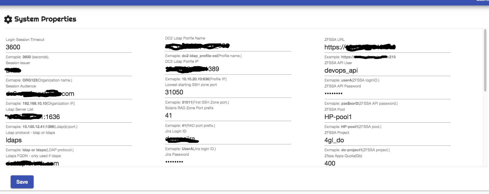

<h3>Please read the Quick Starting Guide before following the below <a href="quick-setup.md">System Setup Documentation</a>.</h3>

To access the Web-UI you go to.
<pre>
# In development mode
http://localhost:4201

# In production mode
https://yourhost # for example https://dc2-confmgr1.domain.com
</pre>

The first you have to do is register an admin account, an example is below.

Click on register, then type your new account - make sure to select local for authentication type.
 

Note: You can register as many accounts as you like, however all other/newer accounts will have to be enabled in the Administration section(an example is below).

Next Login with the new account.
 

You shuld now see the Main Menu
 

Next, you have to configure the system before using. head over to the App version section.

Application version.
 

Create two entry's. a <b>db</b> and an <b>app</b>.
Type a default version. this is your starting version, the one you created on the ZFS appliance.
Note: Once configure the system will auto maintain this to keep it current.

Next, lets head over to the System Properties.
In <i>System Properties</i> you configure all system settings, including your primary Data Center, List of global hosts per Data Center, login/password to your Solaris Global's. Your ZFS Appliance address, login, password, timeouts. LDAP information, Jira information if used. and finaly your logging settings (info or debug).
 

Part two shows you parts of the Zone Create options. to access part two, please click here <a href="web-ui-configuration-part2.md">Zone Admin Documentation</a>.
