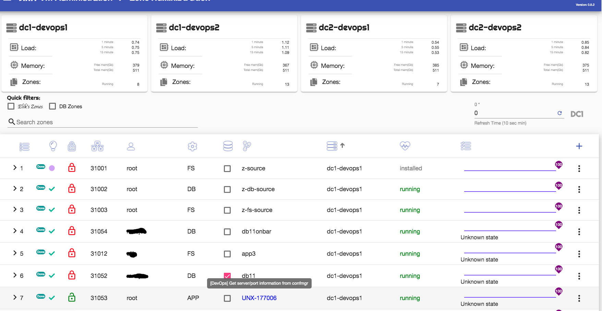

Please read the Quick Starting Guide before following the below <a href="quick-setup.md">System Setup Documentation</a>.

To access the Web-UI you go to.
<pre>
# In development mode
http://localhost:4201

# In production mode
https://yourhost # for example https://dc2-confmgr1.domain.com
</pre>

Part one shows you basic login and system configuration. to access part one, please click here <a href="web-ui-configuration-part1.md">System Configuration Documentation</a>.

After the system is configured, i.e. you updated the Solaris Global host names, login, password etc.. in System Properties, you can now continue to the Zone Administration section.

Once In the <i>Zone Administration</i> section you shuld see on the top part a list of your Solaris Global Host as well as there health status, an example is below.
 

Note: If any zones are already on the system , they will be auto discovered and showin in the Web-UI.

To add a new zone, just click on the <i>+</i> sign on right side/top, you shuld see a screen like the one below..
 

You have the option to select a normal app Zone, or a DB/FS zone. Also if you use Jira this will auto update the Jira fields with zone port and zone server.
Note: Once you submit a new zone, a job gets created and the zone is being crated in the background

The below options are available for most zone types.
 

If you need to refresh one of the zones ZFS file systems, you can do so. below is an example.
 

Note: By refreshing a file system all modified data will be destroyed, a fresh snap/clone will be created. you normally use this option if you like to use a new/latter version, or you just like a fresh copy.

To remove a Zone is just as easy, just select the delete option, the zones and snaps will be deleted. an example is below.
 

Note: The system will show you what and how many file systems/snap are effected (in case of zone type db/fs).

You can update zone properties, for example put the zone in maintenance mode, you do that by the edit screen (example below).
 

You can disable/enable/refresh/etc... SMF services, you do that by the SMF screen (example below).
 

Note: There are a number of other options not covered here like Power-On/Off/reboot.
